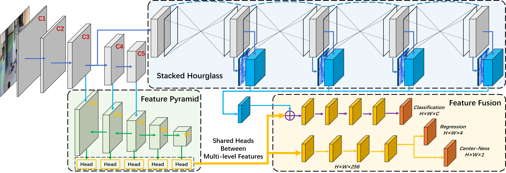

# FCOS_POSE
Codes for my paper *"[Student Dangerous Behavior Detection in School](https://arxiv.org/abs/2202.09550)"*. Currently, we have only tested the effectiveness of our method on the personal collected danger behavior dataset. You can build a similar dataset by yourself, and transfer our `FCOS_POSE` framework based on FCOS (object detection) and auxiliary keypoints (pose estimation) to your human behavior detection task.



## Installation
**Note:** Our FCOS_POSE is mostly based on the original object detection method [FCOS](https://github.com/tianzhi0549/FCOS). You can follow it to set the environment. Our pose estimation backbone is the [StackedHourglasses](https://github.com/princeton-vl/pytorch_stacked_hourglass).

**Environment:** Anaconda, Python3.8, PyTorch1.10.0(CUDA11.2)

``` bash
$ git clone https://github.com/hnuzhy/fcos_pose.git
$ pip install -r requirements.txt -i https://pypi.tuna.tsinghua.edu.cn/simple

# Codes are only evaluated on GTX3090+CUDA11.2+PyTorch1.10.0. You can follow the same config if needed
# [method 1][directly install from the official website][may slow]
$ pip3 install torch==1.10.0+cu111 torchvision==0.11.1+cu111 torchaudio==0.10.0+cu111 \
  -f https://download.pytorch.org/whl/cu111/torch_stable.html
  
# [method 2]download from the official website and install offline][faster]
$ wget https://download.pytorch.org/whl/cu111/torch-1.10.0%2Bcu111-cp38-cp38-linux_x86_64.whl
$ wget https://download.pytorch.org/whl/cu111/torchvision-0.11.1%2Bcu111-cp38-cp38-linux_x86_64.whl
$ wget https://download.pytorch.org/whl/cu111/torchaudio-0.10.0%2Bcu111-cp38-cp38-linux_x86_64.whl
$ pip3 install torch*.whl

# install the lib with symbolic links
$ python setup.py build develop --no-deps
```

## Dataset Preparing

**Note:** We are sorry that due to privacy issues, our personal dangerous behavior dataset cannot be released for public use. We can only provide an overview of the data set production process.

* **Step 1:** Collect videos containing dangerous behaviors (e.g., `fight`, `tumble`, and `squat`). Sample frames every N (e.g., 3) seconds. Then, annotate dangerous behaviors with bounding boxes. You can use the popular online annotation tool [CVAT](https://cvat.org/).
* **Step 2:** After annotation (about 10K images totally), export your dataset in the `PascalVOC` format (`JPEGImages` folder contains selected frames, `Annotations` folder contains corresponding labels in XML format).
* **Step 3:** Convert the annotations from `PascalVOC` XML style to `COCO` JSON style. We recommend you to refer the scripts in [voc2coco](https://github.com/yukkyo/voc2coco). Support that you finally get two (train and val) json annotation files `coco_dangerdet_train.json` and `coco_dangerdet_val.json`.
* **Step 4:** Generate keypoints for all persons appearing in frames under the `JPEGImages` folder. We use the robust bottom-up method [OpenPifPaf](https://github.com/vita-epfl/openpifpaf) to detect all auxiliary skeletons. Because they are auxiliary labels, the imprecision of keypoints will not affect the normal execution of training. Support that you finally get all keypoints json files under the `Keypoints_JSON` folder.
* **Step 5:** Update the json annotation files in **Step 3** with adding keypoints information. We provide an example script [voc2cocoWpose.py](./tools/voc2cocoWpose.py). Finally, you will get two new json annotation files `coco_dangerdet_Wpose_train.json` and `coco_dangerdet_Wpose_val.json`.


## Training and Testing

**Note:** Our method is essentially an object detection task. So we still adopt pretrained weights of FCOS. Please refer the official repo to download corresponding [models](https://github.com/tianzhi0549/FCOS#models)

* **Yamls**

We put the dataset paths and parameter configs involved in the training in the yaml file. Taking [fcos_R_50_FPN_1x_coco_pose2_full.yaml](./configs/danger_det/fcos_R_50_FPN_1x_coco_pose2_full.yaml) as an example. We only describe the parts that need to be modified.
```bash
MODEL:
  POSENET_ON: True
  FCOS:
    NUM_CLASSES: 4  # COCO is 80+1, DangerDet is 3+1
  POSENET:
    N_STACK: 2  # the num of stacked hourglasses
    OUTPUT_DIM: 17  #  number of keypoints / heatmaps, COCO:17 MPII:16
    FUSE_TYPE: "FULL"  # default is "LAST", you can choose "FULL"
DATASETS:
  TRAIN: ("coco_dangerdet_Wpose_train",)  # all images shape imgh:imgw = 1600:2400 = 2:3
  TEST: ("coco_dangerdet_val",)  # when testing, we do not need pose labels
INPUT:
  MIN_SIZE_TRAIN: (768,)  # 1/8 * 1/16, input shape is 768:1152 = 2:3, 768*1/8*1/16 = 6
  MAX_SIZE_TRAIN: 1280
  MIN_SIZE_TEST: 768
  MAX_SIZE_TEST: 1280
SOLVER:  # Adjust parameters according to your actual needs
  BASE_LR: 0.004  # 0.01
  WEIGHT_DECAY: 0.0001
  STEPS: (9000, 12000)
  MAX_ITER: 15000
  CHECKPOINT_PERIOD: 3500
  IMS_PER_BATCH: 12  # 16
  WARMUP_METHOD: "constant"
```

* **Training**

Still taking `fcos_R_50_FPN_1x_coco_pose2_full.yaml` as an example.

```bash
CUDA_VISIBLE_DEVICES=2,3 python -m torch.distributed.launch \
  --nproc_per_node=2 --master_port=$((RANDOM + 10000)) \
  tools/train_net.py \
  --config-file configs/danger_det/fcos_R_50_FPN_1x_coco_pose2.yaml \
  DATALOADER.NUM_WORKERS 2 \
  OUTPUT_DIR training_dir/dangerdet_fcos_R_50_FPN_1x_coco_pose2
```

* **Testing**

```bash
CUDA_VISIBLE_DEVICES=1 python tools/test_net.py \
  --config-file configs/danger_det/fcos_R_50_FPN_1x_coco_pose2.yaml \
  MODEL.WEIGHT training_dir/dangerdet_fcos_R_50_FPN_1x_coco_pose2/model_final.pth \
  TEST.IMS_PER_BATCH 16
```

## References
* [FCOS: Fully Convolutional One-Stage Object Detection](https://github.com/tianzhi0549/FCOS)
* [Stacked Hourglass Networks in Pytorch](https://github.com/princeton-vl/pytorch_stacked_hourglass)
